---

## **Advanced Customer Segmentation**

### 📌 Project Overview  
This project applies **various clustering and classification techniques** to segment customers based on their characteristics. It includes **K-Means, Hierarchical Clustering, DBSCAN, Decision Trees, Random Forests, Neural Networks, and SVM**, providing a comprehensive approach to customer segmentation.

By leveraging **unsupervised and supervised learning models**, this project delivers an **automated, scalable, and interpretable** segmentation solution.

---

### 📊 **Initial Data Analysis & Visualization**  
Before applying clustering techniques, **exploratory data analysis (EDA)** is performed to understand the structure and distribution of customer attributes.

📌 **Distribution of Features:**  
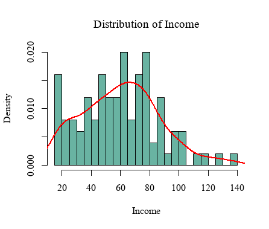

📌 **Pairwise Relationship Plot:**  
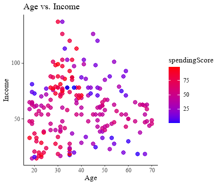

📌 **Density Plot:**  
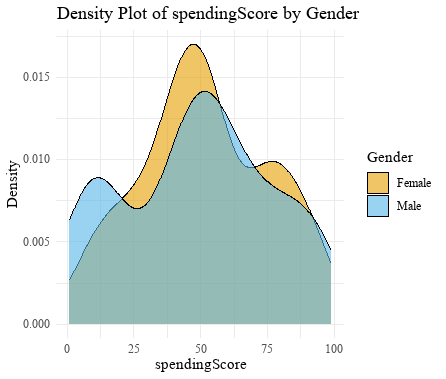

📌 **Box Plot:**  
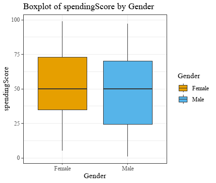

---

### 🚀 **Clustering Techniques Implemented**

#### **1️⃣ K-Means Clustering**  
- K-Means is a **centroid-based clustering** method that partitions data into **K clusters** based on similarity.  
- The **Elbow Method** and **Silhouette Analysis** are used to determine the optimal number of clusters.

📌 **Elbow Method for Optimal K:**  
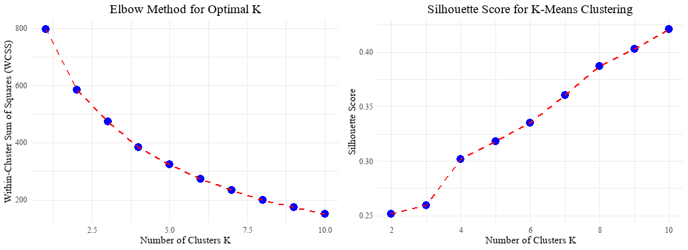  

📌 **K-Means Cluster Visualization:**  
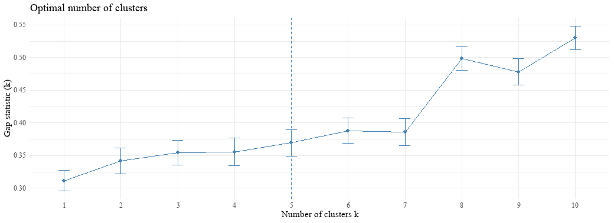

---

#### **2️⃣ Hierarchical Clustering**  
- Hierarchical clustering builds a **tree-like structure (dendrogram)** to visualize relationships between customers.  
- Ward’s method is used to minimize variance within clusters.

📌 **Dendrogram (Hierarchical Clustering):**  
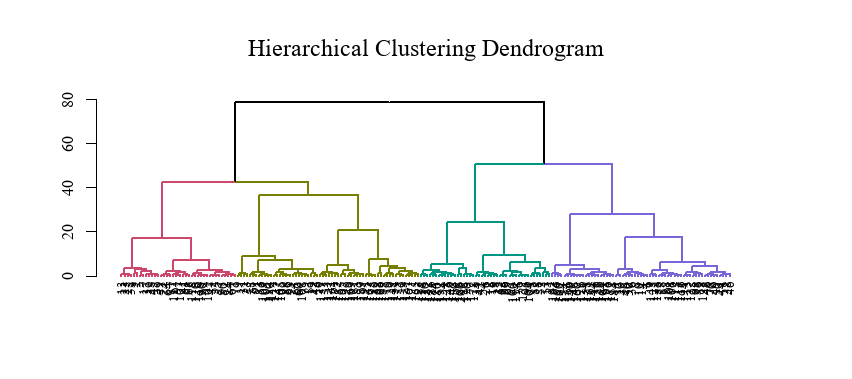

📌 **Hierarchical Clusters Visualization:**  
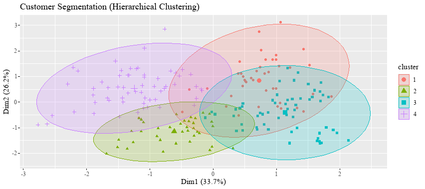
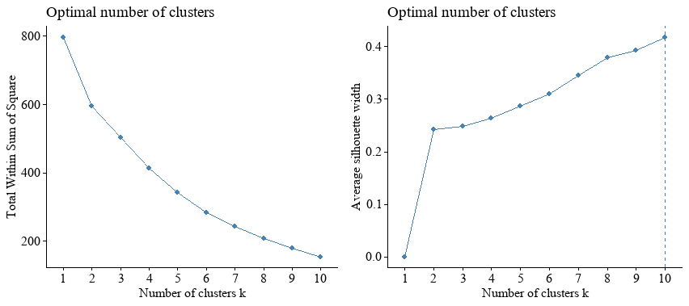

---

#### **1️⃣ DBSCAN (Density-Based Spatial Clustering of Applications with Noise)**  
- DBSCAN is a **density-based** clustering algorithm that groups core samples and detects noise.
- This method is effective for identifying **arbitrary-shaped clusters** and handling outliers.

📌 **DBSCAN Output:**  
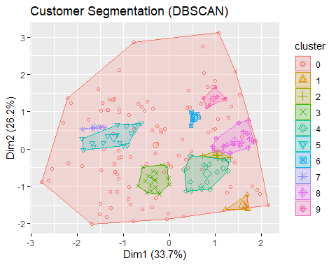

---

#### **2️⃣ Decision Tree (CART - Classification and Regression Tree)**  
- A **Decision Tree** is trained to classify customers into clusters based on feature splits.  
- It provides an **interpretable model** for understanding customer segmentation.

📌 **Decision Tree Output:**  
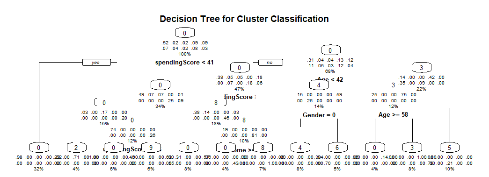

---

#### **3️⃣ Random Forests**  
- A **Random Forest** classifier is used to improve classification accuracy.  
- Feature importance ranking helps understand which attributes drive customer segmentation.

📌 **Feature Importance Plot:**  
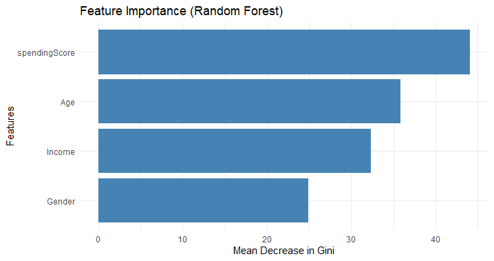

---

#### **5️⃣ Support Vector Machines**  
- **SVM** is used to find the best **decision boundary** for segmenting customers.  
- Kernel trick is applied to handle non-linearity in data.

📌 **SVM Decision Boundary:**  
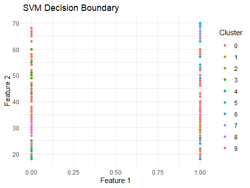

---

### ⚙ **How to Run the Project**
1️⃣ **Clone the Repository:**  
```sh
git clone https://github.com/yourusername/customer-segmentation.git
cd customer-segmentation
```

2️⃣ **Install Required Libraries in R:**  
```r
install.packages(c("tidyverse", "dbscan", "factoextra", "cluster", 
                   "ggplot2", "rpart", "rpart.plot", "randomForest", 
                   "nnet", "e1071"))
```

3️⃣ **Run the Segmentation Script:**  
```r
source("customer_segmentation.R")
```

---

### 🎯 **Customization and Parameter Tuning**
- **DBSCAN:** Modify `eps` and `minPts` to adjust cluster density.
- **Decision Trees & Random Forests:** Tune `ntree` and `mtry` for better classification.
- **Neural Networks:** Adjust hidden layers (`size`), regularization (`decay`), and iterations (`maxit`).
- **SVM:** Change kernel type (`linear`, `radial`, `polynomial`) to improve separation.

---

### 📜 **License**
This project is open-source and available under the **MIT License**.

---

✅ **This project provides a comprehensive approach to customer segmentation using advanced machine learning techniques.**  
💡 **Use this repository to improve your understanding of clustering, classification, and model evaluation!** 🚀  

---
---

#### **🔗 Connect & Follow**  
👨‍💻 **Author:** Joel Mande 
📧 **Email:** joelwanjala09@gmail.com.com  
🌐 **LinkedIn:** [Joel Mande](https://www.linkedin.com/in/wajoel)  

---
